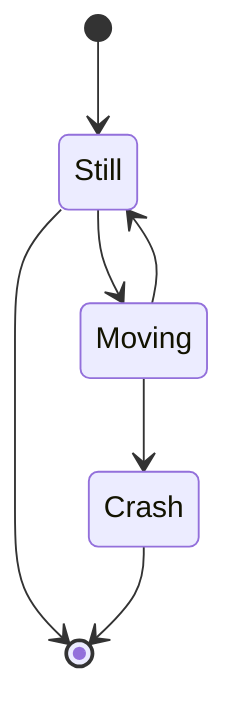

## Introduktion Diwise
diwise är en IoT-kommunikationsplattform för att ta emot sensordata och reglera fysiska styrsystem som innebär att verksamhetssystem frikopplas från både kommunikationsgränssnitt och olika sensortyper.

## Dokumentation
Här på denna yta kommer vi publicera teknisk information samt dokumentation gällande plattformen Diwise. 

## Kontakt
Behöver du komma i kontakt med oss eller vill du veta mer om vad vi kan erbjuda? Läs mer på vår webbplats, [diwise.io](https://diwise.io/)
